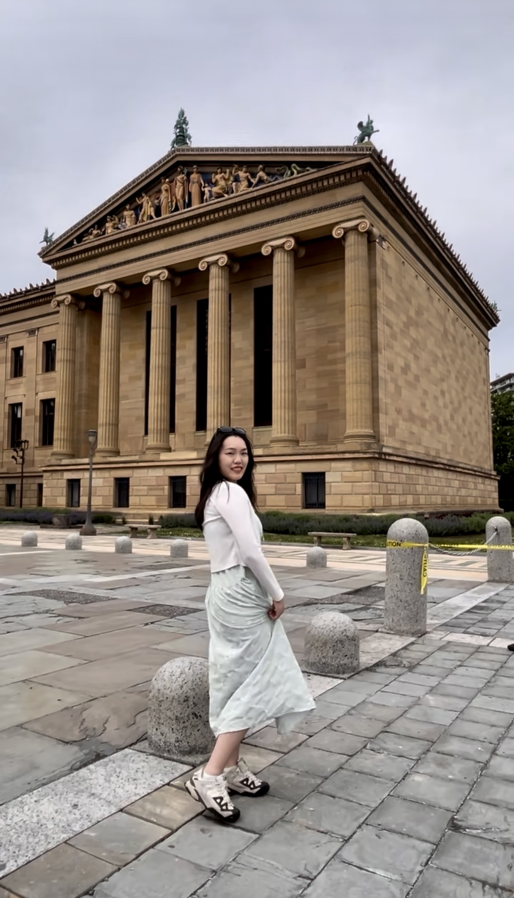

# Yun-Han-Wang-s-Homepage
**[Home](./)** | **[Education](education.md)** | **[Publications](publications.md)** | **[Experience](experience.md)** | **[Awards & Skills](awards_and_skills.md)**
***

<!-- 請將 profile_photo.jpg 替換為您的照片檔名，並上傳至同一個 GitHub 資料夾 -->

# YUN-HAN WANG[cite: 1]

Ph.D. Student, Chinese Linguistics track[cite: 1]  
Department of East Asian Languages and Cultures[cite: 1]  
Indiana University Bloomington[cite: 1]

[Email](mailto:yw202@iu.edu)[cite: 1] / [CV](./260205_cv_韻涵.pdf) / [Google Scholar](#) / [GitHub](#)

## Biography & Research Interests

I am a Ph.D. student in the Department of East Asian Languages and Cultures (Chinese Linguistics track) at Indiana University Bloomington[cite: 1]. 

My primary research interests lie in **syntax-semantics**, **cognitive-linguistics**, and **corpus linguistics**[cite: 1]. I focus extensively on formal semantics and utilize corpus linguistics software and tools, such as AntConc and customized VBA macros in Microsoft Word, for efficient data analysis.

---

## News

* **[May 2026]** Delivering an oral presentation at the 38th North American Conference on Chinese Linguistics (NACCL-38) in Washington, D.C[cite: 1].
* **[April 2026]** Upcoming academic presentation scheduled for April 6.
* **[Spring 2026]** Received the Indiana University EASC Conference Travel Award[cite: 1].
